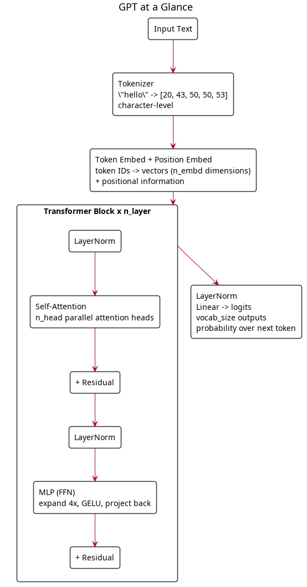

# Train Your Own LLM From Scratch

A hands-on workshop where you write every piece of a GPT training pipeline yourself, understanding what each component does and why.

Andrej Karpathy's [nanoGPT](https://github.com/karpathy/nanoGPT) was my first real exposure to LLMs and transformers. Seeing how a working language model could be built in a few hundred lines of PyTorch completely changed how I thought about AI and inspired me to go deeper into the space.

This workshop is my attempt to give others that same experience. nanoGPT targets reproducing GPT-2 (124M params) and covers a lot of ground. This project strips it down to the essentials and scales it to a ~10M param model that trains on a laptop in under an hour — designed to be completed in a single workshop session.

## What You'll Build

A working GPT model trained from scratch on your MacBook, capable of generating Shakespeare-like text. You'll write:

- **Tokenizer** — turning text into numbers the model can process
- **Model architecture** — the transformer: embeddings, attention, feed-forward layers
- **Training loop** — forward pass, loss, backprop, optimizer, learning rate scheduling
- **Text generation** — sampling from your trained model

## Prerequisites

- Any laptop or desktop (Mac, Linux, or Windows)
- Python 3.12+
- Comfort reading Python code (you don't need ML experience)

Training uses Apple Silicon GPU (MPS), NVIDIA GPU (CUDA), or CPU automatically. Also works on [Google Colab](https://colab.research.google.com/) — upload the files and run with `!python train.py`.

## Getting Started

### Local (recommended)

Install [uv](https://docs.astral.sh/uv/) if you don't have it:

```bash
# macOS / Linux
curl -LsSf https://astral.sh/uv/install.sh | sh

# Windows
powershell -ExecutionPolicy ByPass -c "irm https://astral.sh/uv/install.ps1 | iex"
```

Then set up the project:

```bash
uv sync
mkdir scratchpad && cd scratchpad
```

### Google Colab

If you don't have a local setup, upload the repo to Colab and install dependencies:

```python
!pip install torch numpy tqdm tiktoken
```

Upload `data/shakespeare.txt` to your Colab files, then write your code in notebook cells or upload `.py` files and run them with `!python train.py`.

---

Work through the docs in order. Each part walks you through writing a piece of the pipeline, explaining what each component does and why. By the end, you'll have a working `model.py`, `train.py`, and `generate.py` that you wrote yourself.

| Part | What You'll Write | Concepts |
|------|-------------------|----------|
| [Part 1: Tokenization](docs/01-tokenization.md) | Character-level tokenizer | Character encoding, vocabulary size, why BPE fails on small data |
| [Part 2: The Transformer](docs/02-the-transformer.md) | Full GPT model architecture | Embeddings, self-attention, layer norm, MLP blocks |
| [Part 3: The Training Loop](docs/03-training-loop.md) | Complete training pipeline | Loss functions, AdamW, gradient clipping, LR scheduling |
| [Part 4: Text Generation](docs/04-text-generation.md) | Inference and sampling | Temperature, top-k, autoregressive decoding |
| [Part 5: Putting It All Together](docs/05-putting-it-together.md) | Train on real data, experiment | Loss curves, scaling experiments, next steps |
| [Part 6: Competition](docs/06-competition.md) | Train the best AI poet | Find datasets, scale up, submit your best poem |

## Architecture: GPT at a Glance



## Model Configs for This Workshop

| Config | Params | n_layer | n_head | n_embd | Train Time (M3 Pro) |
|--------|--------|---------|--------|--------|---------------------|
| Tiny | ~0.5M | 2 | 2 | 128 | ~5 min |
| Small | ~4M | 4 | 4 | 256 | ~20 min |
| **Medium (default)** | **~10M** | **6** | **6** | **384** | **~45 min** |

All configs use character-level tokenization (vocab_size=65) and block_size=256.

## Tokenization: Characters vs BPE

This workshop uses **character-level** tokenization on Shakespeare. BPE tokenization (GPT-2's 50k vocab) doesn't work on small datasets — most token bigrams are too rare for the model to learn patterns from.

| Tokenizer | Vocab Size | Dataset Size Needed |
|-----------|-----------|-------------------|
| **Character-level** | ~65 | Small (Shakespeare, ~1MB) |
| **BPE (tiktoken)** | 50,257 | Large (TinyStories+, 100MB+) |

Part 5 covers switching to BPE for larger datasets.

## Key References

- [nanoGPT](https://github.com/karpathy/nanoGPT) — The project this workshop is based on. Minimal GPT training in ~300 lines of PyTorch
- [build-nanogpt video lecture](https://github.com/karpathy/build-nanogpt) — 4-hour video building GPT-2 from an empty file
- [Karpathy's microgpt](http://karpathy.github.io/2026/02/12/microgpt/) — A full GPT in 200 lines of pure Python, no dependencies
- [nanochat](https://github.com/karpathy/nanochat) — Full ChatGPT clone training pipeline
- [Attention Is All You Need (2017)](https://arxiv.org/abs/1706.03762) — The original transformer paper
- [GPT-2 paper (2019)](https://cdn.openai.com/better-language-models/language_models_are_unsupervised_multitask_learners.pdf) — Language models as unsupervised learners
- [TinyStories paper](https://arxiv.org/abs/2305.07759) — Why small models trained on curated data punch above their weight
