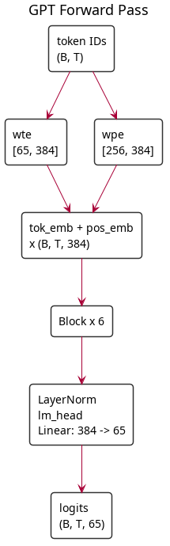
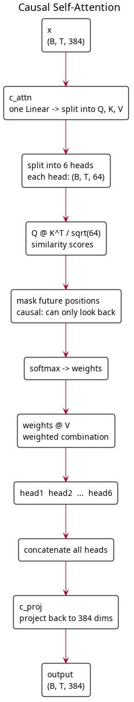
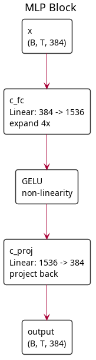
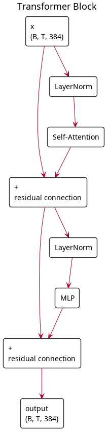

# Part 2: The Transformer

This is the core of the workshop. You'll write the full GPT model architecture from scratch in PyTorch.

## The Big Picture

A GPT is an **autoregressive language model**: given a sequence of tokens, it predicts the next one. Stack this prediction in a loop and you get text generation.

The architecture is a stack of identical **transformer blocks**, each containing:
1. **Multi-head self-attention** — lets each token look at all previous tokens
2. **Feed-forward network (MLP)** — processes each position independently
3. **Residual connections** — add the input back to the output of each sub-layer
4. **Layer normalization** — stabilizes training

## Write It: `model.py`

Create a new file called `model.py` in your scratchpad. You'll add each class one at a time as you read through this section. By the end, the file will contain `GPTConfig`, `CausalSelfAttention`, `MLP`, `Block`, and `GPT`.

### Configuration

```python
from dataclasses import dataclass

@dataclass
class GPTConfig:
    vocab_size: int = 65       # character-level: 65 unique chars in Shakespeare
    block_size: int = 256      # max sequence length (context window)
    n_layer: int = 6           # number of transformer blocks
    n_head: int = 6            # number of attention heads
    n_embd: int = 384          # embedding dimension
```

`vocab_size` comes from the tokenizer (65 characters for Shakespeare). `block_size` is the maximum number of tokens the model can see at once. `n_embd` is the width of the model — every hidden state is a vector of this size.

### Embeddings

```python
import torch
import torch.nn as nn

class GPT(nn.Module):
    def __init__(self, config):
        super().__init__()
        self.config = config
        self.transformer = nn.ModuleDict(dict(
            wte = nn.Embedding(config.vocab_size, config.n_embd),   # token embeddings
            wpe = nn.Embedding(config.block_size, config.n_embd),   # position embeddings
            h = nn.ModuleList([Block(config) for _ in range(config.n_layer)]),
            ln_f = nn.LayerNorm(config.n_embd),
        ))
        self.lm_head = nn.Linear(config.n_embd, config.vocab_size, bias=False)
        # weight tying: the output projection shares weights with the token embeddings
        self.transformer.wte.weight = self.lm_head.weight
```

Two embedding tables:
- **`wte`** (word token embedding): maps each token ID to a learned vector. Size: `[65, 384]`
- **`wpe`** (word position embedding): maps each position (0 to 255) to a learned vector. Size: `[256, 384]`

**Weight tying**: the same matrix that maps tokens → embeddings is reused (transposed) to map embeddings → logits at the output. This reduces parameters and improves training — the model's input and output representations of tokens are forced to be consistent. With our small vocab of 65 this saves very little, but it's standard practice and matters a lot with large vocabularies.

### Forward Pass

```python
    def forward(self, idx, targets=None):
        B, T = idx.shape
        pos = torch.arange(0, T, device=idx.device)

        tok_emb = self.transformer.wte(idx)    # (B, T, n_embd)
        pos_emb = self.transformer.wpe(pos)    # (T, n_embd)
        x = tok_emb + pos_emb                  # (B, T, n_embd) — broadcasting adds position info

        for block in self.transformer.h:
            x = block(x)

        x = self.transformer.ln_f(x)
        logits = self.lm_head(x)               # (B, T, vocab_size)

        loss = None
        if targets is not None:
            loss = nn.functional.cross_entropy(
                logits.view(-1, logits.size(-1)),
                targets.view(-1)
            )
        return logits, loss
```



The position embedding is added to the token embedding — this is how the model knows word order. Without it, "the dog bit the man" and "the man bit the dog" would look identical.

### Self-Attention

This is the mechanism that lets each token attend to (look at) every previous token in the sequence.

```python
class CausalSelfAttention(nn.Module):
    def __init__(self, config):
        super().__init__()
        assert config.n_embd % config.n_head == 0
        self.c_attn = nn.Linear(config.n_embd, 3 * config.n_embd)  # Q, K, V projections
        self.c_proj = nn.Linear(config.n_embd, config.n_embd)       # output projection
        self.n_head = config.n_head
        self.n_embd = config.n_embd

    def forward(self, x):
        B, T, C = x.shape
        qkv = self.c_attn(x)
        q, k, v = qkv.split(self.n_embd, dim=2)

        # reshape for multi-head: (B, T, C) → (B, n_head, T, head_dim)
        head_dim = C // self.n_head
        q = q.view(B, T, self.n_head, head_dim).transpose(1, 2)
        k = k.view(B, T, self.n_head, head_dim).transpose(1, 2)
        v = v.view(B, T, self.n_head, head_dim).transpose(1, 2)

        # attention with causal mask (each token can only attend to previous tokens)
        y = torch.nn.functional.scaled_dot_product_attention(
            q, k, v, is_causal=True
        )

        y = y.transpose(1, 2).contiguous().view(B, T, C)
        return self.c_proj(y)
```



Breaking this down:

1. **Q, K, V projections**: A single linear layer projects the input into three matrices — Query, Key, and Value. Each is `(B, T, n_embd)`.

2. **Multi-head reshape**: We split the embedding dimension into `n_head` separate heads, each with `head_dim = n_embd / n_head = 64` dimensions. This lets the model attend to different aspects of the input in parallel.

3. **Scaled dot-product attention**: For each query position, compute a similarity score against all key positions, mask out future positions (causal), apply softmax, and use the result to weight the values. The math: `softmax(QK^T / sqrt(head_dim)) @ V`

4. **Causal masking** (`is_causal=True`): Position `i` can only attend to positions `0..i`. This prevents the model from "cheating" by looking at future tokens during training. This is what makes GPT **autoregressive**.

5. **Output projection**: Concatenate all heads and project back to `n_embd` dimensions.

### Why Multi-Head?

With 6 heads of 64 dimensions each (instead of one head of 384 dimensions), the model can simultaneously track different relationships: one head might track which vowels follow consonants, another might track line-break patterns, another might focus on recent context.

### MLP Block

```python
class MLP(nn.Module):
    def __init__(self, config):
        super().__init__()
        self.c_fc = nn.Linear(config.n_embd, 4 * config.n_embd)
        self.gelu = nn.GELU(approximate='tanh')
        self.c_proj = nn.Linear(4 * config.n_embd, config.n_embd)

    def forward(self, x):
        x = self.c_fc(x)       # project up: 384 → 1536
        x = self.gelu(x)       # non-linearity
        return self.c_proj(x)  # project back down: 1536 → 384
```



The MLP is applied independently to each position. It expands the representation to 4x the embedding dimension, applies a non-linearity (GELU), and projects back down. This is where the model does most of its "thinking" — the attention gathers information, the MLP processes it.

**Why GELU instead of ReLU?** GELU (Gaussian Error Linear Unit) is smoother than ReLU. It doesn't have a hard cutoff at zero, which helps gradient flow. GPT-2 uses the `tanh` approximation for speed.

### Transformer Block

```python
class Block(nn.Module):
    def __init__(self, config):
        super().__init__()
        self.ln_1 = nn.LayerNorm(config.n_embd)
        self.attn = CausalSelfAttention(config)
        self.ln_2 = nn.LayerNorm(config.n_embd)
        self.mlp = MLP(config)

    def forward(self, x):
        x = x + self.attn(self.ln_1(x))   # attention with residual connection
        x = x + self.mlp(self.ln_2(x))    # MLP with residual connection
        return x
```



Two key design choices:

1. **Pre-norm** (LayerNorm before attention/MLP, not after): This stabilizes training by normalizing inputs to each sub-layer. The original transformer paper used post-norm, but pre-norm is now standard.

2. **Residual connections** (`x = x + sublayer(x)`): The input is added back to the output. This lets gradients flow directly through the network during backpropagation, making deep networks trainable. Without residuals, a 6-layer network would be much harder to train.

### Parameter Count

```python
config = GPTConfig()
model = GPT(config)
n_params = sum(p.numel() for p in model.parameters())
print(f"Parameters: {n_params / 1e6:.1f}M")  # ~10.8M
```

Where do the parameters live?
- Token embeddings: `65 × 384 = 25K` (tiny with char-level vocab — shared with lm_head)
- Position embeddings: `256 × 384 = 98K`
- Per transformer block: `~1.8M` (attention: 4 × 384² = 590K, MLP: 2 × 384 × 1536 = 1.2M, norms: negligible)
- 6 blocks: `~10.6M`
- Total: `~10.8M`

Notice how almost all the parameters are in the transformer blocks, not the embeddings. With GPT-2's 50k vocab, the embedding table would be 50,257 × 384 = 19.3M — nearly double the entire model. This is why vocab size matters.

## Key Takeaways

- A GPT is a stack of identical transformer blocks
- Each block: LayerNorm → Self-Attention → Residual → LayerNorm → MLP → Residual
- Self-attention lets tokens look at all previous tokens (causal masking prevents looking ahead)
- Multi-head attention runs multiple attention patterns in parallel
- Residual connections and layer norm make deep networks trainable
- Weight tying between input embeddings and output projection reduces parameters

## Next: [Part 3 — The Training Loop →](03-training-loop.md)
