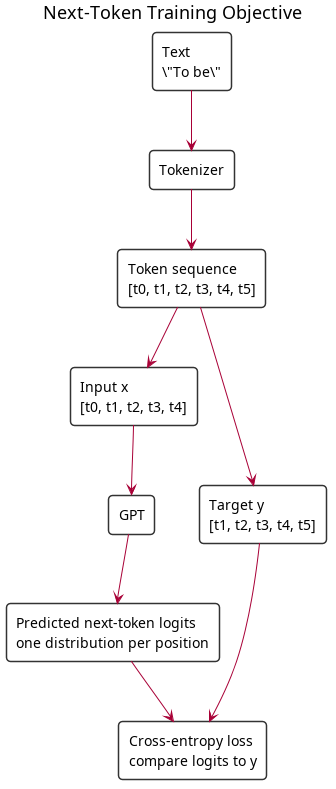
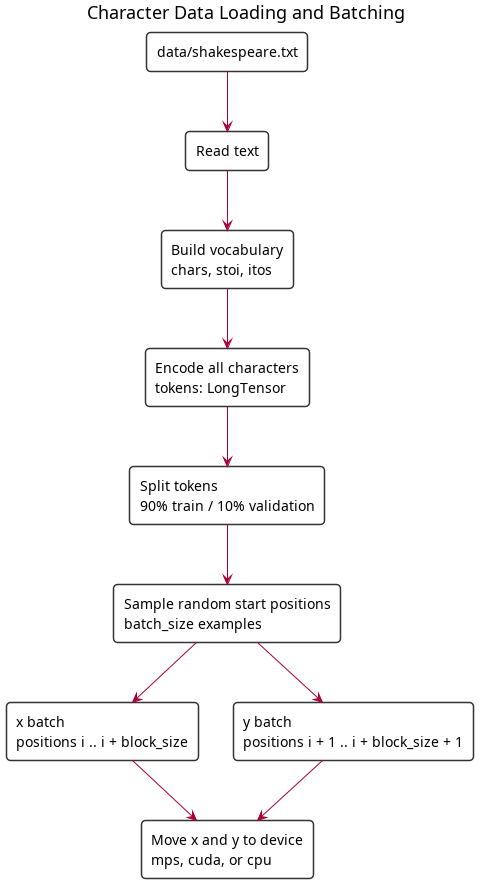
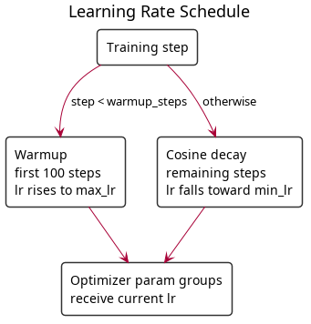
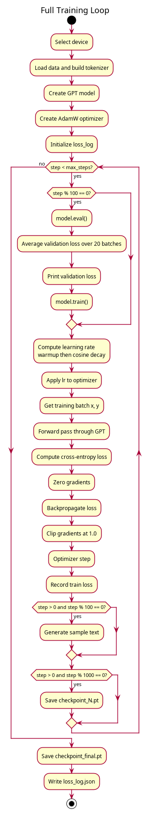
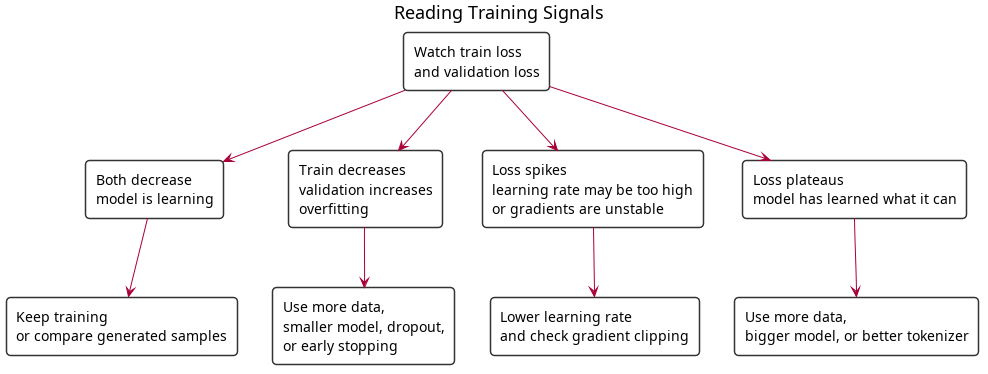

# Part 3: The Training Loop

You have a model. Now you need to teach it language. The training loop is where the model actually learns, and every decision here affects whether your model converges or diverges into nonsense.

## The Training Objective

GPT is trained with **next-token prediction**: given tokens `[t0, t1, ..., tn]`, predict `[t1, t2, ..., tn+1]`. The loss function is cross-entropy between the model's predicted probability distribution and the actual next token.

This is a self-supervised task — the labels come from the data itself. Every piece of text is simultaneously input and target, just shifted by one position.



## Write It: `train.py`

Create a new file called `train.py` in your scratchpad. This file imports from `model.py` (which you wrote in Part 2) and from `generate.py` (which you'll write in Part 4 — skip the sample generation for now and come back to add it after Part 4).

Add each piece below to `train.py` as you read through this section.

### Step 1: Data Loading (Character-Level)

```python
import torch

def load_data(filepath, block_size, batch_size, device):
    with open(filepath, "r") as f:
        text = f.read()

    chars = sorted(set(text))
    vocab_size = len(chars)
    stoi = {c: i for i, c in enumerate(chars)}
    itos = {i: c for c, i in stoi.items()}

    tokens = torch.tensor([stoi[c] for c in text], dtype=torch.long)
    print(f"Dataset: {len(tokens):,} chars, vocab size: {vocab_size}")

    def get_batch(split_tokens):
        ix = torch.randint(len(split_tokens) - block_size - 1, (batch_size,))
        x = torch.stack([split_tokens[i:i + block_size] for i in ix]).to(device)
        y = torch.stack([split_tokens[i + 1:i + block_size + 1] for i in ix]).to(device)
        return x, y

    n = int(0.9 * len(tokens))
    get_train = lambda: get_batch(tokens[:n])
    get_val = lambda: get_batch(tokens[n:])
    return get_train, get_val, vocab_size, stoi, itos
```

Each batch:
- Sample `batch_size` random starting positions
- `x`: characters from position `i` to `i + block_size` (input)
- `y`: characters from position `i+1` to `i + block_size + 1` (target — shifted by one)

The function returns `stoi`/`itos` mappings alongside the batch generators — you'll need these for text generation.



### Step 2: Device Setup

```python
def get_device():
    if torch.backends.mps.is_available():
        return torch.device("mps")     # Apple Silicon GPU
    elif torch.cuda.is_available():
        return torch.device("cuda")    # NVIDIA GPU
    return torch.device("cpu")
```

On a MacBook with Apple Silicon, MPS gives roughly 2-3x speedup over CPU.

### Step 3: Learning Rate Schedule

```python
import math

def get_lr(step, warmup_steps, max_steps, max_lr, min_lr):
    if step < warmup_steps:
        return max_lr * (step + 1) / warmup_steps
    if step >= max_steps:
        return min_lr
    progress = (step - warmup_steps) / (max_steps - warmup_steps)
    return min_lr + 0.5 * (max_lr - min_lr) * (1 + math.cos(math.pi * progress))
```

Two phases:

1. **Warmup** (first ~100 steps): Ramp the learning rate from near-zero up to `max_lr`. This gives the optimizer time to calibrate its moment estimates before making large updates.

2. **Cosine decay** (remaining steps): Smoothly decrease the learning rate. Large updates early (explore), small updates late (refine).



### Step 4: The Optimizer

```python
optimizer = torch.optim.AdamW(model.parameters(), lr=1e-3, weight_decay=0.01)
```

For character-level training on Shakespeare, plain `AdamW` with `lr=1e-3` and light weight decay works well. The full GPT-2 recipe (separate decay groups, betas=(0.9, 0.95), weight_decay=0.1) is designed for large-scale BPE training and is overkill here.

### Step 5: The Full Training Loop



```python
import json
from tqdm import tqdm

def train(data_path, max_steps=5000, batch_size=64,
          n_layer=6, n_head=6, n_embd=384, block_size=256):
    device = get_device()
    print(f"Using device: {device}")

    get_train_batch, get_val_batch, vocab_size, stoi, itos = load_data(
        data_path, block_size, batch_size, device
    )

    config = GPTConfig(
        vocab_size=vocab_size,
        block_size=block_size,
        n_layer=n_layer,
        n_head=n_head,
        n_embd=n_embd,
    )
    model = GPT(config).to(device)
    print(f"Model: {n_layer}L/{n_head}H/{n_embd}D, "
          f"{sum(p.numel() for p in model.parameters()) / 1e6:.1f}M params")

    optimizer = torch.optim.AdamW(model.parameters(), lr=1e-3, weight_decay=0.01)

    max_lr = 1e-3
    min_lr = max_lr * 0.1
    warmup_steps = 100

    loss_log = {"steps": [], "train": [], "val": []}

    pbar = tqdm(range(max_steps), desc="Training")
    for step in pbar:
        # --- validation loss ---
        if step % 100 == 0:
            model.eval()
            with torch.no_grad():
                val_losses = []
                for _ in range(20):
                    x, y = get_val_batch()
                    _, loss = model(x, y)
                    val_losses.append(loss.item())
                val_loss = sum(val_losses) / len(val_losses)
                tqdm.write(f"Step {step:5d} | val loss: {val_loss:.4f}")
            model.train()

        # --- update learning rate ---
        lr = get_lr(step, warmup_steps, max_steps, max_lr, min_lr)
        for param_group in optimizer.param_groups:
            param_group["lr"] = lr

        # --- training step ---
        x, y = get_train_batch()
        _, loss = model(x, y)
        optimizer.zero_grad()
        loss.backward()
        torch.nn.utils.clip_grad_norm_(model.parameters(), max_norm=1.0)
        optimizer.step()

        pbar.set_postfix(loss=f"{loss.item():.4f}", lr=f"{lr:.2e}")

        # --- log loss ---
        loss_log["steps"].append(step)
        loss_log["train"].append(loss.item())
        if step % 100 == 0:
            loss_log["val"].append(val_loss)

        # --- generate sample ---
        if step > 0 and step % 100 == 0:
            model.eval()
            sample = generate(model, "To be or not", stoi, itos,
                            max_new_tokens=100, temperature=0.8)
            tqdm.write(f"\n--- Step {step} sample ---\n{sample}\n---\n")
            model.train()

        # --- save checkpoint ---
        if step > 0 and step % 1000 == 0:
            torch.save({
                "step": step,
                "model_state_dict": model.state_dict(),
                "config": config,
                "stoi": stoi,
                "itos": itos,
            }, f"checkpoint_{step}.pt")

    # --- save final checkpoint and loss log ---
    torch.save({
        "step": max_steps,
        "model_state_dict": model.state_dict(),
        "config": config,
        "stoi": stoi,
        "itos": itos,
    }, "checkpoint_final.pt")

    with open("loss_log.json", "w") as f:
        json.dump(loss_log, f)

    return model, stoi, itos
```

### Step 6: Entry Point

Add this to the bottom of `train.py` so you can run it from the terminal:

```python
if __name__ == "__main__":
    train("../data/shakespeare.txt")
```

This calls the training function with the default config (6L/6H/384D, 5000 steps) and the included Shakespeare dataset. You can customize the model by passing different arguments:

```python
if __name__ == "__main__":
    import sys
    data_path = sys.argv[1] if len(sys.argv) > 1 else "../data/shakespeare.txt"
    train(data_path)
```

### What Each Part Does

**Validation loss**: Every 100 steps, evaluate on held-out data. If train loss goes down but val loss goes up, you're overfitting.

**Gradient clipping** (`clip_grad_norm_`): Caps the total gradient magnitude at 1.0. Prevents occasional large gradients from blowing up the weights.

**Sample generation**: Every 100 steps, generate text so you can watch the model learn. You'll see it go from random characters → random words → Shakespeare-like text.

**Checkpointing**: Save model state periodically. Checkpoints include `stoi`/`itos` so you can generate text from a saved model without the original data. A final checkpoint is saved as `checkpoint_final.pt` at the end of training.

**Loss log**: Training and validation losses are saved to `loss_log.json` so you can plot loss curves after training (see Part 5).

## What Loss Numbers Mean (Character-Level, vocab=65)

- **~4.2**: Random (untrained). `ln(65) ≈ 4.17`
- **~3.3**: Learned character frequencies (which letters are common)
- **~2.5**: Learned common bigrams ("th", "he", "in")
- **~1.5-2.0**: Generates recognizable words and Shakespeare-like structure
- **~1.0-1.2**: Good quality — generates verse with character names, line breaks
- **<1.0**: Likely memorizing the training data

## Watching the Model Learn

Here's what a real training run looks like (6L/6H/384D, batch_size=64, M3 Pro). The prompt is always "To be or not":

**Step 200** (val loss: ~3.5) — Random characters, no words:
```
To be or notis p ce mei odorethleedetire'ilethed ye m arkesothir fnon b tigb'i.
```

**Step 800** (val loss: ~1.8) — Words forming, character names appearing:
```
To be or not men, and my lord.

ROMEO:
Thou sir, do content the he, stray, there ir;
```

**Step 1000** (val loss: 1.64) — Coherent phrases, Shakespeare structure:
```
To be or nothing are good men,
The profent of little, our actory.

CORIOLANUS:
Is it now of your many death?
```

**Step 2400** (val loss: ~1.60) — Peak quality. Plausible Shakespeare:
```
To be or not to be some of you shall know
That everlature by Romeo: what news,
Which you had knock'd my part to speak
```

**Step 3500** (val loss: 2.34) — Overfitting. Still fluent but less creative:
```
To be or nothing, take me but most profane,
That offer them not amish. If I defeath
Is not a puggival and self,
```

## Overfitting: Train Loss vs Val Loss

With 10M parameters and only ~1M characters of Shakespeare, the model will **overfit** — it memorizes the training data instead of learning general patterns. You'll see this clearly:

```
Step   500 | val loss: 2.14   ← dropping fast, learning structure
Step  1000 | val loss: 1.64   ← still improving
Step  1500 | val loss: 1.57   ← best region
Step  2000 | val loss: 1.59   ← starting to plateau
Step  2500 | val loss: 1.71   ← val loss going UP — overfitting
Step  3000 | val loss: 1.98   ← getting worse
Step  3500 | val loss: 2.34   ← fully memorizing (train loss is 0.54)
```

The **best model** is around step 1500-2000 (val loss ~1.57), not step 5000. After that, every step makes the model *worse* at generating novel text — it's just getting better at reciting the training data.



### What Causes Overfitting?

The model has **10M parameters** learning from **~1M characters**. That's a 10:1 parameter-to-data ratio — the model has more than enough capacity to memorize every character in the training set. The fix is always the same: **more data** or **smaller model**.

### What to Do About It

For this workshop, overfitting is expected and fine — it demonstrates an important concept. In practice you would:

1. **Use more data** — TinyStories (476M tokens) would keep a 10M model learning much longer
2. **Use a smaller model** — a 2L/2H/128D model (~0.5M params) overfits much slower on Shakespeare
3. **Add dropout** — randomly zeroing activations during training acts as regularization
4. **Stop early** — save the checkpoint with the lowest val loss and use that

## Typical Training on MacBook (Character-Level Shakespeare)

| Model | Params | Batch Size | Steps | Time (M3 Pro) | Best Val Loss | Overfits At |
|-------|--------|-----------|-------|---------------|---------------|-------------|
| 6L/6H/384D | ~10M | 64 | 5,000 | ~45 min | ~1.7 (step 2500) | ~step 1500 |
| 4L/4H/256D | ~4M | 64 | 5,000 | ~20 min | ~1.6 (step 3000) | ~step 2000 |
| 2L/2H/128D | ~0.5M | 64 | 5,000 | ~5 min | ~1.8 (step 5000) | barely |

The 6L model gets the best samples fastest but overfits soonest. The 2L model trains quickly and barely overfits, but the output quality is lower. This is the fundamental tradeoff: **model capacity vs data size**.

Start with the 6L/6H/384D config. With batch_size=64 on an M3 Pro, you get ~1.9 it/s.

## Key Takeaways

- The objective is next-character prediction with cross-entropy loss
- Character-level tokenization works best for small datasets — BPE vocab is too sparse
- AdamW with lr=1e-3 and cosine decay is a good starting point
- Gradient clipping at 1.0 prevents training instability
- Generate samples during training — it's the best way to see progress
- **Watch the gap between train and val loss** — when val loss starts rising, you're overfitting
- The best model isn't the one with the lowest train loss — it's the one with the lowest val loss

## Next: [Part 4 — Text Generation →](04-text-generation.md)
