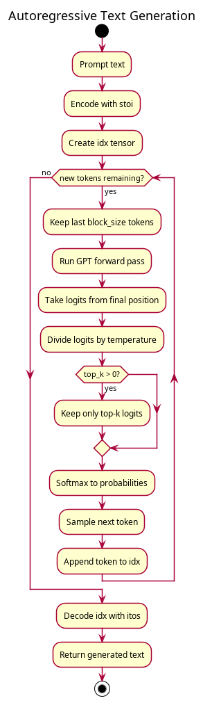

# Part 4: Text Generation

Your model is trained. Now let's make it write. Text generation with a GPT is **autoregressive**: generate one token at a time, append it to the input, and repeat.

Create a new file called `generate.py` in your scratchpad. Once you've written it, go back to `train.py` and add `from generate import generate` at the top — this enables the sample generation during training that you skipped in Part 3.

## The Naive Approach: Greedy Decoding

Always pick the most probable next token.

```python
def generate_greedy(model, idx, max_new_tokens):
    for _ in range(max_new_tokens):
        idx_cond = idx[:, -model.config.block_size:]
        logits, _ = model(idx_cond)
        logits = logits[:, -1, :]
        next_token = logits.argmax(dim=-1, keepdim=True)
        idx = torch.cat([idx, next_token], dim=1)
    return idx
```

This is deterministic — the same prompt always produces the same output. It tends to be repetitive and boring because the highest-probability continuation reinforces itself.

## Temperature

Scale the logits before applying softmax. Higher temperature = more random, lower = more deterministic.

```python
logits = logits / temperature
```

The math: softmax computes `exp(logit_i) / sum(exp(logit_j))`. Dividing all logits by temperature changes the distribution:
- **T = 1.0**: Normal probabilities
- **T → 0**: Approaches greedy (argmax)
- **T > 1.0**: Flattens the distribution, giving rare tokens more chance
- **T = 0.7-0.9**: The typical sweet spot for coherent but varied text

## Top-k Sampling

Only consider the k most probable tokens. Set everything else to `-inf`.

```python
if top_k > 0:
    values, _ = torch.topk(logits, top_k)
    logits[logits < values[:, -1:]] = float("-inf")
```

This prevents the model from sampling extremely unlikely tokens. With a character-level model (vocab=65), `top_k=40` is reasonable — it still considers most characters but excludes the very unlikely ones.

## The Full Generate Function

```python
@torch.no_grad()
def generate(model, prompt, stoi, itos, max_new_tokens=200, temperature=0.8, top_k=40):
    device = next(model.parameters()).device
    tokens = [stoi[c] for c in prompt if c in stoi]
    idx = torch.tensor([tokens], dtype=torch.long, device=device)

    model.eval()
    for _ in range(max_new_tokens):
        idx_cond = idx[:, -model.config.block_size:]
        logits, _ = model(idx_cond)
        logits = logits[:, -1, :] / temperature

        if top_k > 0:
            values, _ = torch.topk(logits, top_k)
            logits[logits < values[:, -1:]] = float("-inf")

        probs = torch.softmax(logits, dim=-1)
        next_token = torch.multinomial(probs, num_samples=1)
        idx = torch.cat([idx, next_token], dim=1)

    return "".join([itos[i] for i in idx[0].tolist()])
```

The pipeline for each token:
1. Run the model on the current sequence → get logits for next position
2. Apply temperature scaling
3. Filter with top-k (remove very unlikely tokens)
4. Convert to probabilities with softmax
5. Sample from the distribution with `multinomial`
6. Append the sampled token and repeat



`@torch.no_grad()` disables gradient computation — we don't need it for inference and it saves memory.

The function takes `stoi`/`itos` mappings from the training data — these define how characters map to token IDs and back.

### Command-Line Interface

Add this to the bottom of `generate.py` so you can run it from the terminal:

```python
if __name__ == "__main__":
    import argparse

    parser = argparse.ArgumentParser(description="Generate text from a trained GPT checkpoint")
    parser.add_argument("checkpoint", help="Path to checkpoint file (e.g. checkpoint_final.pt)")
    parser.add_argument("--prompt", default="To be or not", help="Starting text for generation")
    parser.add_argument("--max_new_tokens", type=int, default=200, help="Number of tokens to generate")
    parser.add_argument("--temperature", type=float, default=0.8, help="Sampling temperature (lower = more deterministic)")
    parser.add_argument("--top_k", type=int, default=40, help="Only sample from top-k most likely tokens")
    parser.add_argument("--seed", type=int, default=None, help="Random seed for reproducibility")
    args = parser.parse_args()

    if args.seed is not None:
        torch.manual_seed(args.seed)

    checkpoint = torch.load(args.checkpoint, weights_only=False)
    config = checkpoint["config"]
    stoi = checkpoint["stoi"]
    itos = checkpoint["itos"]

    model = GPT(config)
    model.load_state_dict(checkpoint["model_state_dict"])

    output = generate(model, args.prompt, stoi, itos,
                      max_new_tokens=args.max_new_tokens,
                      temperature=args.temperature,
                      top_k=args.top_k)
    print(output)
```

## Reproducibility with Seeds

Generation involves random sampling (`torch.multinomial`), so the same prompt produces different output each time. To get reproducible results, set a seed before generating:

```python
torch.manual_seed(42)
print(generate(model, "To be or not", stoi, itos, temperature=0.8))
# same output every time with seed=42
```

From the command line:
```bash
python generate.py checkpoint_final.pt --prompt "To be or not" --seed 42
```

## Try Different Settings

```python
checkpoint = torch.load("checkpoint_final.pt", weights_only=False)
config = checkpoint["config"]
stoi = checkpoint["stoi"]
itos = checkpoint["itos"]

model = GPT(config)
model.load_state_dict(checkpoint["model_state_dict"])

# deterministic, repetitive
print(generate(model, "To be or not to be", stoi, itos, temperature=0.1))

# balanced
print(generate(model, "To be or not to be", stoi, itos, temperature=0.8))

# creative, potentially incoherent
print(generate(model, "To be or not to be", stoi, itos, temperature=1.5))
```

## What to Expect

Here are real samples from a training run (6L/6H/384D on Shakespeare):

### Step 200 (val loss ~3.5) — Random characters
```
To be or notis p ce mei odorethleedetire'ilethed ye m arkesothir fnon b tigb'i.
```

### Step 1000 (val loss 1.64) — Words and structure emerging
```
To be or nothing are good men,
The profent of little, our actory.

CORIOLANUS:
Is it now of your many death?
```

### Step 2400 (val loss ~1.60) — Peak quality, plausible Shakespeare
```
To be or not to be some of you shall know
That everlature by Romeo: what news,
Which you had knock'd my part to speak
```

Note: the best output is around step 1500-2500. After that, the model overfits and starts regurgitating memorized training data (see Part 3 for details).

## Key Takeaways

- Autoregressive generation: predict one token, append, repeat
- Greedy decoding is deterministic and repetitive
- Temperature controls randomness (0.7-0.9 is usually good)
- Top-k removes extremely unlikely tokens
- With character-level models, generate samples during training to watch the model learn

## Next: [Part 5 — Putting It All Together →](05-putting-it-together.md)
