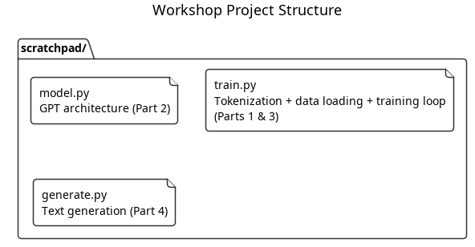
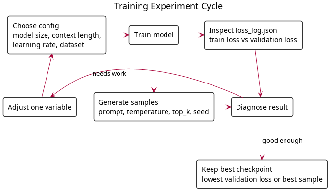

# Part 5: Putting It All Together

Time to wire everything up, train on real data, and prepare for the competition.

## Project Structure

By now you should have:



The Shakespeare dataset is included in the repo at `data/shakespeare.txt` — no download needed.

### Google Colab

If you're using Colab instead of a local setup:

1. Open a new notebook at [colab.research.google.com](https://colab.research.google.com/)
2. Go to **Runtime → Change runtime type → GPU (T4)**
3. Install dependencies in the first cell:
   ```python
   !pip install -q torch numpy tqdm tiktoken
   ```
4. Download Shakespeare:
   ```python
   import urllib.request, os
   os.makedirs("data", exist_ok=True)
   urllib.request.urlretrieve(
       "https://raw.githubusercontent.com/karpathy/char-rnn/master/data/tinyshakespeare/input.txt",
       "data/shakespeare.txt"
   )
   ```
5. Write your model, training loop, and generate code in notebook cells (paste from the docs or write it yourself)
6. Use `"data/shakespeare.txt"` as the data path (not `"../data/shakespeare.txt"`)

A ready-to-run notebook is also included at `colab.ipynb` in the repo.

## Step 1: Train

```bash
cd scratchpad
python train.py
```

The default config trains a 6L/6H/384D model (~10M params) on Shakespeare for 5000 steps with batch_size=64. On an M3 Pro this takes ~45 minutes. You'll see:

- Val loss + generated samples every 100 steps
- Checkpoints every 1000 steps
- Final checkpoint + loss log at the end

## Step 2: Generate

```bash
python generate.py checkpoint_final.pt
```

This loads a checkpoint and generates text from three prompts. You can pass any checkpoint file as an argument.

## Step 3: Experiment

Once the basic pipeline works, try these to build intuition before the competition:



### Model Size vs. Quality

Train three models on the same data and compare output quality:

| Config | Params | n_layer | n_head | n_embd | Expected Loss |
|--------|--------|---------|--------|--------|---------------|
| Tiny | ~0.5M | 2 | 2 | 128 | ~2.0 |
| Small | ~4M | 4 | 4 | 256 | ~1.5 |
| Medium | ~10M | 6 | 6 | 384 | ~1.2 |

Modify the `train()` call in `train.py`:

```python
# tiny — fast, good for testing ideas
model, stoi, itos = train(data_path, n_layer=2, n_head=2, n_embd=128)

# medium — default, good baseline
model, stoi, itos = train(data_path, n_layer=6, n_head=6, n_embd=384)

# large — needs more data to justify
model, stoi, itos = train(data_path, n_layer=12, n_head=12, n_embd=768)
```

### Context Length

Train with `block_size=128` vs `block_size=512`. Longer context lets the model capture full stanzas and rhyme schemes, but uses more memory (reduce batch_size to compensate).

### Learning Rate

Try `3e-4` (conservative), `1e-3` (default), `3e-3` (aggressive). The right LR depends on your model size and data.

## Monitoring Training

The training loop saves `loss_log.json`. You can plot it with any tool:

```python
# pip install matplotlib
import json, matplotlib.pyplot as plt

with open("loss_log.json") as f:
    log = json.load(f)

plt.figure(figsize=(10, 6))
plt.plot(log["steps"], log["train"], alpha=0.3, label="train")
plt.xlabel("Step")
plt.ylabel("Loss")
plt.legend()
plt.savefig("loss_curve.png")
plt.show()
```

### What to Look For

- **Train loss not decreasing**: Learning rate too low, or a bug
- **Train loss decreasing, val loss increasing**: Overfitting — more data or smaller model
- **Loss spikes**: Reduce learning rate or check gradient clipping
- **Loss plateaus**: Model has learned what it can. More data or bigger model

## Now: The Competition

You've trained a model, you've seen it overfit, you've experimented with configs. Now apply everything you've learned.

### [Part 6 — Competition: Best AI Poet →](06-competition.md)

The goal: find a good poetry dataset, train the best model you can, and submit the best poem your model generates. You can change anything — the data, the model size, the tokenizer, the training strategy. The only rules: you train it from scratch on your laptop, and the poem comes from the model.

## Further Reading

- [Karpathy's microgpt](http://karpathy.github.io/2026/02/12/microgpt/) — A full GPT in 200 lines of pure Python
- [build-nanogpt video lecture](https://github.com/karpathy/build-nanogpt) — 4-hour video building GPT-2 from an empty file
- [nanochat](https://github.com/karpathy/nanochat) — Full ChatGPT clone training pipeline
- [Attention Is All You Need (2017)](https://arxiv.org/abs/1706.03762) — The original transformer paper
- [GPT-2 paper (2019)](https://cdn.openai.com/better-language-models/language_models_are_unsupervised_multitask_learners.pdf) — Language models as unsupervised learners
- [TinyStories paper](https://arxiv.org/abs/2305.07759) — Small models trained on curated data
- [Chinchilla (2022)](https://arxiv.org/abs/2203.15556) — Optimal scaling of data vs. parameters
